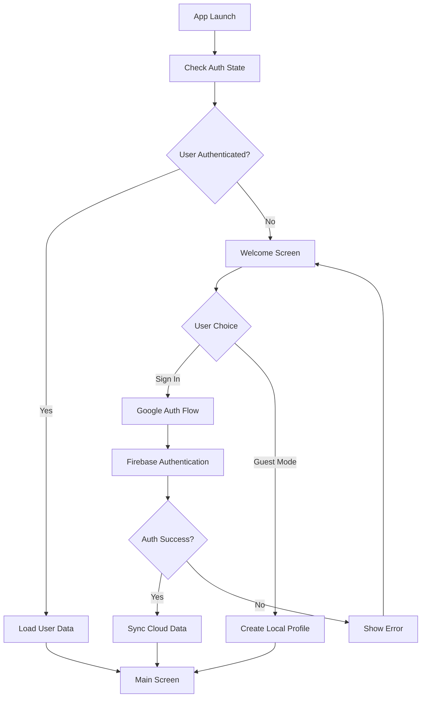
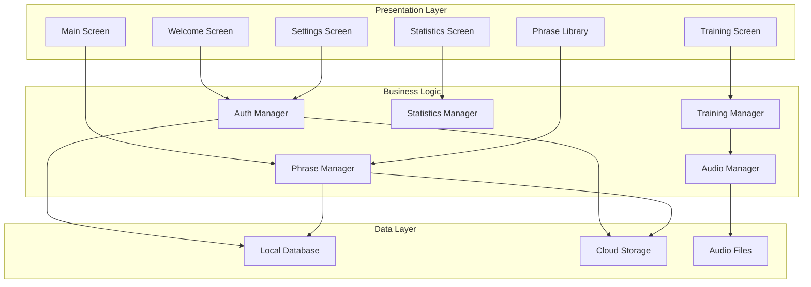
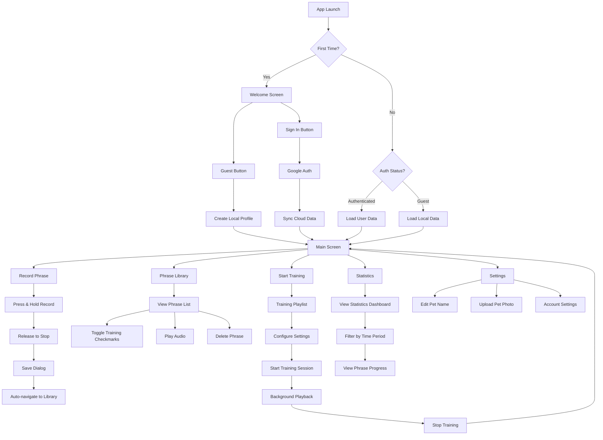
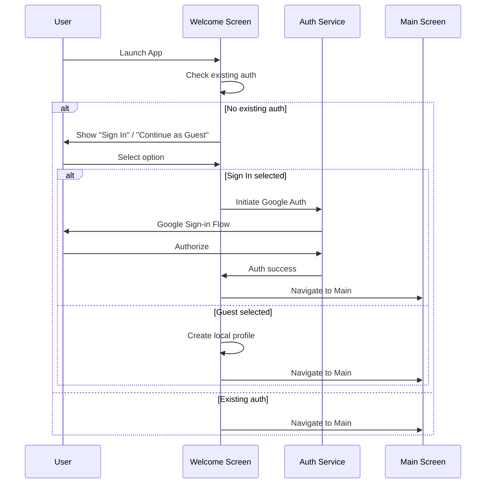
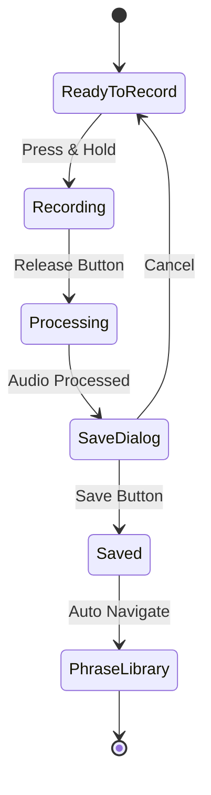
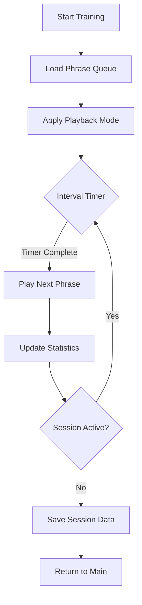
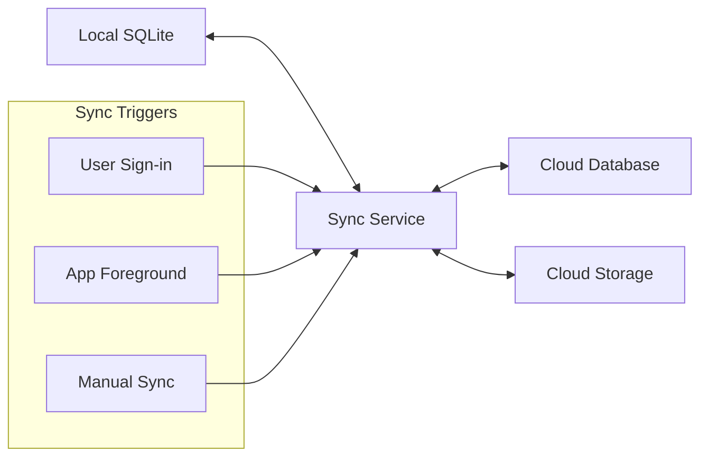

# User Onboarding and Authentication Design Document

## Overview

The ToParrot application is a mobile Flutter app designed to help users train their parrots through phrase repetition and audio learning. The app provides an intuitive interface for recording, managing, and playing back phrases to facilitate parrot training, with user authentication to sync progress across devices and enable subscription features.

## Technology Stack & Dependencies

- **Framework**: Flutter (iOS/Android)
- **Authentication**: Firebase Auth / Supabase Auth
- **Backend**: Firebase / Supabase
- **Audio Recording**: flutter_sound / audio_waveforms
- **State Management**: Provider / Riverpod
- **Local Storage**: SQLite (sqflite) / Hive
- **Animations**: Flutter animations package, Lottie/Rive
- **Cloud Storage**: Firebase Storage (for audio files)

## Authentication Architecture

### Authentication Flow



### User Authentication States

| State | Description | Data Storage | Features Available |
|-------|-------------|--------------|-------------------|
| **Guest User** | Local profile only | Device storage (SQLite) | Basic training, local phrases |
| **Authenticated User** | Google account linked | Cloud + Local sync | Full features, subscriptions, cross-device sync |

### Authentication Components

- **Auth Service**: Handles Firebase/Supabase authentication
- **User Repository**: Manages user data persistence
- **Sync Service**: Synchronizes local data with cloud when user signs in

## Component Architecture

### Core Components



### Component Hierarchy

#### Authentication Components
- `WelcomeScreen` - Initial authentication choice
- `AuthService` - Google authentication handling
- `UserRepository` - User data management

#### Main Interface Components
- `MainScreen` - Primary navigation hub
- `ParrotAvatar` - Animated parrot character
- `StatsWidget` - Mini statistics display
- `NavigationButtons` - Main action buttons

#### Phrase Management Components
- `PhraseRecorder` - Audio recording modal
- `PhraseLibrary` - Phrase list management
- `PhrasePlayer` - Audio playback controls
- `PhraseCard` - Individual phrase display

#### Training Components
- `TrainingScreen` - Main training interface
- `PlaylistManager` - Training queue management
- `TrainingControls` - Playback settings
- `ProgressTracker` - Training statistics

## Action Flow & User Interactions

### Complete User Action Flow



### Detailed Action Sequences

#### Authentication Action Flow
1. **App Launch**
   - System checks authentication state
   - If first launch → Welcome Screen
   - If returning user → Auto-login or Main Screen

2. **Sign In Process**
   - User taps "Sign In" button
   - Google authentication modal appears
   - User selects Google account
   - System validates credentials
   - Cloud data synchronization begins
   - Navigate to Main Screen

3. **Guest Mode Process**
   - User taps "Continue as Guest"
   - System creates local profile
   - Navigate directly to Main Screen

#### Phrase Recording Action Flow
1. **Recording Initiation**
   - User taps "Record Phrase" on Main Screen
   - Recording modal appears with instructions
   - User sees "Press to start recording" message

2. **Recording Process**
   - User presses and holds record button
   - Button turns red and pulses
   - Recording timer starts
   - User speaks phrase

3. **Recording Completion**
   - User releases button
   - Recording stops automatically
   - Save dialog appears immediately
   - Auto-generated name with timestamp

4. **Save Process**
   - User edits phrase name (optional)
   - User taps "Save" button
   - Phrase saved to local database
   - Auto-navigate to Phrase Library
   - New phrase appears at top of list

#### Library Management Action Flow
1. **Library Access**
   - User taps "Phrase Library" on Main Screen
   - List of all phrases loads with animations
   - Each phrase shows: name, play button, delete, training toggle

2. **Training Selection**
   - User taps checkmark next to phrase
   - Phrase highlights green
   - Checkmark animates with drawing effect
   - Training counter updates on Main Screen

3. **Audio Playback**
   - User taps play button
   - Circular progress bar appears
   - Audio plays with visual feedback
   - Button morphs to pause during playback

4. **Phrase Deletion**
   - User taps delete button
   - Confirmation dialog appears
   - If confirmed, phrase slides out and disappears
   - Library list updates automatically

#### Training Session Action Flow
1. **Training Setup**
   - User taps "Start Training" on Main Screen
   - Training screen loads with selected phrases
   - User sees playlist of training phrases
   - Training controls visible (mode, interval)

2. **Configuration**
   - User adjusts interval slider (5s to 5min)
   - User selects playback mode (loop/random/sequential)
   - User can add/remove phrases from training list

3. **Training Execution**
   - User taps "Start Training"
   - Button changes to "Stop Training"
   - First phrase begins playing
   - Timer countdown starts for next phrase
   - Current phrase highlighted

4. **Session Management**
   - Phrases play according to selected mode
   - Session statistics update in real-time
   - Training continues in background if screen locked
   - User can stop training at any time

5. **Session Completion**
   - User taps "Stop Training"
   - Session data saved automatically
   - Statistics updated
   - Return to Main Screen

#### Statistics Viewing Action Flow
1. **Statistics Access**
   - User taps "Statistics" on Main Screen
   - Dashboard loads with staggered animations
   - General statistics card appears first

2. **Time Filter Navigation**
   - User taps time period tabs (Today/Week/All Time)
   - Statistics update with smooth transitions
   - Charts animate to new data

3. **Phrase Progress Review**
   - User scrolls through phrase progress list
   - Each phrase shows completion percentage
   - Progress bars animate on scroll into view

### Error Handling Action Flows

#### Authentication Errors
- **Network Failure**: Show retry button with offline mode option
- **Auth Rejection**: Clear error message with alternative options
- **Account Conflict**: Guided merge process with user choices

#### Recording Errors
- **Permission Denied**: Settings guidance with direct link
- **Storage Full**: Cleanup suggestions with space indicators
- **Audio Failure**: Retry option with troubleshooting tips

#### Playback Errors
- **File Corruption**: Skip to next phrase with notification
- **Audio Device Issues**: Switch to speaker/headphones prompt
- **Background Restrictions**: Permission request with explanation

## User Flow & Screen Architecture

### 1. Welcome & Authentication Flow



### 2. Main Screen Layout

**Left Half**: Animated Parrot
- Dynamic GIF/video animation
- Idle animations (blinking, head movement)
- Reactive animations to user actions
- Personalized greeting with pet name

**Right Half**: Navigation & Stats
- Mini statistics block with motivational text
- Primary action buttons:
  - Start Training
  - Record Phrase  
  - Phrase Library
  - Statistics
  - Settings
  - Information

### 3. Phrase Recording Workflow



#### Recording Interface
- Large circular record button
- "Press to start recording" instruction
- Visual feedback during recording (pulsing red circle)
- Auto-save dialog with placeholder naming

### 4. Phrase Library Management

#### Library Features
- **Phrase Cards**: Each phrase displays:
  - Phrase name
  - Audio player with circular progress
  - Delete button
  - Add/Remove from training (checkmark toggle)
- **Visual States**:
  - Training phrases: Green highlight + checkmark
  - Regular phrases: Default styling
- **Actions Available**:
  - Play audio with progress animation
  - Delete with confirmation
  - Toggle training inclusion

### 5. Training Screen Interface

#### Training Playlist
- List of selected phrases (checkmarked from library)
- Quick add/remove training selection
- Mini audio preview for each phrase

#### Training Controls
- **Playback Modes**:
  - 🔁 Loop single phrase
  - 🔀 Random order
  - ▶️ Sequential playlist
- **Timing Settings**:
  - Interval slider (5s, 10s, 30s, 1min, 5min)
- **Control Buttons**:
  - Start Training → becomes Stop Training
  - Add Phrase (quick library access)

#### Training Session Display
- Current playing phrase prominently displayed
- Session timer
- Phrase repetition counter
- Background/locked screen playback support

### 6. Statistics Dashboard

#### Statistics Blocks

**General Statistics Card**
- Total training time: "5 hours 20 minutes"
- Total phrase repetitions: "3,250 times"
- Phrases in training: "12 phrases"

**Time-based Statistics**
- Tab navigation: Today / Yesterday / Week / All Time
- Daily training time and repetition counts
- Simple progress indicators

**Phrase Progress Table**
- Individual phrase statistics
- Progress bars: "30/50 repetitions (60%)"
- Visual completion indicators

## Data Models & Storage

### User Model
```dart
class User {
  String id;
  String? email;
  String displayName;
  String petName;
  String? petImageUrl;
  bool isGuest;
  DateTime createdAt;
  UserPreferences preferences;
}
```

### Phrase Model
```dart
class Phrase {
  String id;
  String name;
  String audioFilePath;
  Duration duration;
  bool isInTraining;
  int playCount;
  DateTime createdAt;
  bool isCustom; // user-recorded vs preset
}
```

### Training Session Model
```dart
class TrainingSession {
  String id;
  DateTime startTime;
  Duration duration;
  List<String> phraseIds;
  Map<String, int> phrasePlayCounts;
  TrainingMode mode;
  int intervalSeconds;
}
```

### Statistics Model
```dart
class UserStatistics {
  Duration totalTrainingTime;
  int totalRepetitions;
  int phrasesInTraining;
  Map<String, PhraseStat> phraseStats;
  Map<DateTime, DailyStats> dailyStats;
}
```

## Audio Management Architecture

### Audio Service Components
- **AudioRecorder**: Handles phrase recording
- **AudioPlayer**: Manages phrase playback
- **AudioProcessor**: Audio format conversion and optimization
- **AudioStorage**: Local and cloud audio file management

### Audio Workflow
1. **Recording**: High-quality audio capture (AAC/WAV format)
2. **Processing**: Audio compression and normalization
3. **Storage**: Local cache + cloud backup (authenticated users)
4. **Playback**: Optimized streaming with progress tracking

## Training Logic & Algorithms

### Training Session Management



### Playback Modes
- **Sequential**: Play phrases in order, loop when complete
- **Random**: Shuffle phrases, ensure all phrases played before repeat
- **Single Loop**: Repeat one selected phrase continuously

### Progress Tracking
- **Phrase Repetitions**: Count per phrase per session
- **Session Duration**: Track active training time
- **Daily Goals**: Optional progress milestones

## User Interface Animations & Microinteractions

### Authentication Animations
- **Screen Transitions**: Smooth crossfade between auth states
- **Button Feedback**: Scale + shadow on press
- **Loading States**: Gentle pulsing during auth process

### Main Screen Animations
- **Parrot Character**: 
  - Idle breathing animation
  - Blink cycles
  - Reaction animations to user actions
- **Statistics Updates**: Animated counters
- **Greeting Changes**: Smooth text dissolve transitions

### Recording Animations
- **Record Button**: Pulsing red during recording
- **Progress Ring**: Circular timer around record button
- **Save Animation**: Phrase card slides into library

### Library Animations
- **List Loading**: Staggered fade-in of phrase cards
- **Playback Controls**: Play/pause icon morphing
- **Progress Indicators**: Smooth circular progress bars
- **Checkmark Toggle**: Drawing animation for training selection
- **Delete Actions**: Swipe-to-delete with visual feedback

### Training Animations
- **Session Start**: Modal slide-up with playlist
- **Active Phrase**: Gentle glow highlight
- **Mode Switching**: Icon transformation animations
- **Progress Updates**: Live counter animations

### Statistics Animations
- **Dashboard Loading**: Staggered card appearance
- **Data Visualization**: Animated bar/line chart rendering
- **Achievement Notifications**: Micro-confetti on milestones

## Settings & User Profile

### Profile Management
- **Pet Customization**:
  - Pet name editing
  - Pet avatar upload
  - Greeting phrase preferences
- **User Account** (Authenticated):
  - Email display
  - Subscription status
  - Data sync controls

### App Preferences
- **Audio Settings**:
  - Default recording quality
  - Playback volume preferences
- **Training Defaults**:
  - Preferred intervals
  - Default playback mode
- **Notification Settings**:
  - Training reminders
  - Achievement notifications

## Data Synchronization Strategy

### Sync Architecture


### Conflict Resolution
- **Last-Write-Wins**: For user preferences and settings
- **Merge Strategy**: For statistics (cumulative data)
- **User Choice**: For phrase library conflicts

### Offline Support
- **Full Offline Functionality**: All features work without internet
- **Background Sync**: Automatic synchronization when connection available
- **Sync Status Indicators**: Visual feedback for sync state

## Error Handling & Edge Cases

### Authentication Errors
- **Network Issues**: Graceful fallback to guest mode
- **Auth Failures**: Clear error messages with retry options
- **Account Conflicts**: Merge flow for existing local data

### Audio System Errors
- **Permission Denied**: Clear explanation with settings guidance
- **Storage Full**: Cleanup suggestions and cloud backup prompts
- **Playback Failures**: Fallback audio options

### Data Consistency
- **Corruption Recovery**: Local database repair mechanisms
- **Sync Failures**: Retry logic with exponential backoff
- **Version Conflicts**: Safe migration paths for app updates

## Performance Considerations

### Audio Optimization
- **Lazy Loading**: Load audio files on-demand
- **Compression**: Optimize file sizes without quality loss
- **Caching Strategy**: Intelligent local storage management

### UI Performance
- **Animation Optimization**: Use efficient Flutter animation APIs
- **Image Caching**: Optimize parrot avatar rendering
- **List Performance**: Virtual scrolling for large phrase libraries

### Memory Management
- **Audio Cleanup**: Proper disposal of audio resources
- **State Management**: Efficient widget rebuilding
- **Background Processing**: Minimal resource usage during training

## Testing Strategy

### Unit Testing
- **Authentication Service**: Login/logout flows
- **Audio Manager**: Recording and playback functions
- **Statistics Calculator**: Progress tracking accuracy
- **Sync Service**: Data synchronization logic

### Integration Testing
- **User Flows**: Complete workflows from auth to training
- **Database Operations**: CRUD operations with sync
- **Audio Pipeline**: End-to-end recording and playback

### User Acceptance Testing
- **Usability Testing**: Interface intuitive for target users
- **Performance Testing**: Smooth operation on target devices
- **Accessibility Testing**: Screen reader and navigation support